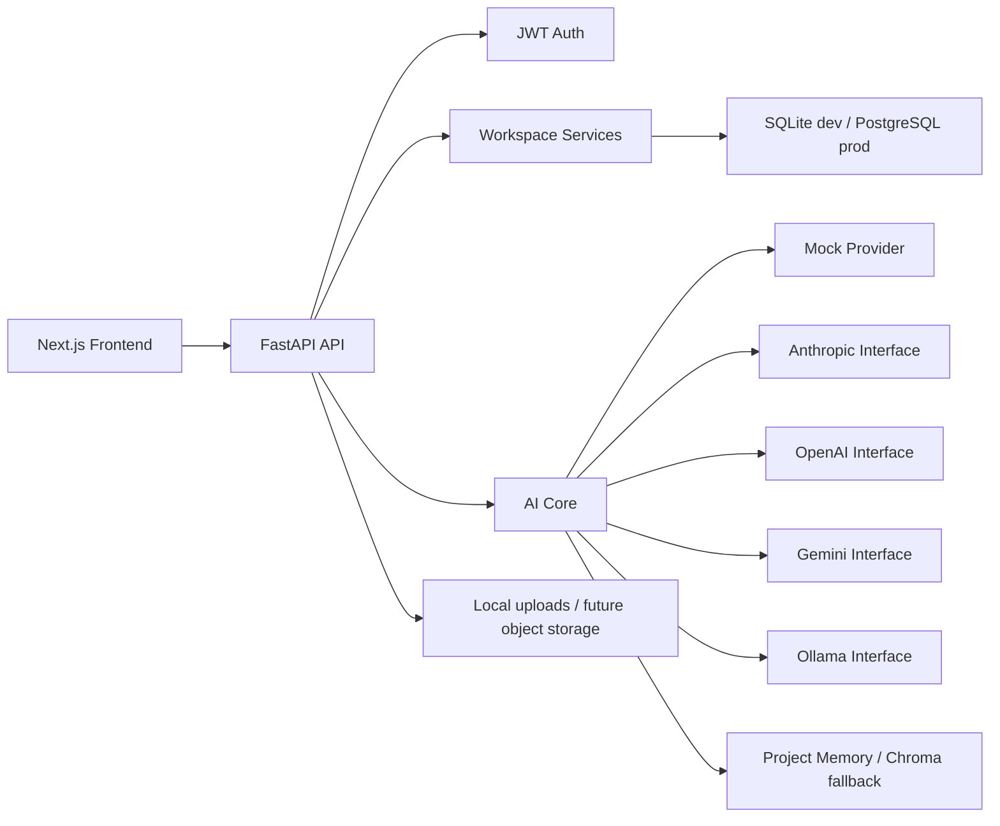

# ProjectOS

ProjectOS is an AI-powered project workspace for students, developers, startup builders, and small teams. It helps users move from idea to deployable project through workspaces, project memory, AI-assisted planning, file understanding, generated outputs, tasks, and subscription-aware usage.

## Features

- JWT authentication with signup, login, and profile lookup
- Workspace, project, task, note, file metadata, generated output, and project memory APIs
- AI core with provider abstraction, registry, cost-aware selection, prompt templates, context building, conversation memory, and agent execution
- Mock AI by default for low-cost Stage 1 operation
- Anthropic, OpenAI, Gemini, and Ollama provider interfaces
- Eleven standardized AI agent classes routed through the AI core
- File upload with text extraction fallback
- Subscription plan APIs for Free, Student, Pro, Team, and Enterprise tiers
- Dashboard summary API
- Next.js dashboard scaffold with auth, project workspace, agents, files, tasks, chat, and subscription pages
- Alembic migrations, Docker Compose, and GitHub Actions CI

## Architecture



## Quick Start With Docker

```bash
docker-compose up --build
```

Backend: `http://localhost:8000`
Frontend: `http://localhost:3000`
API docs: `http://localhost:8000/docs`

## Manual Backend Setup

```bash
python -m venv .venv
.venv\Scripts\python -m pip install -r backend/requirements.txt -r requirements-dev.txt
set SECRET_KEY=dev-secret
set AI_PROVIDER=mock
.venv\Scripts\python -m alembic upgrade head
cd backend
..\ .venv\Scripts\python -m uvicorn app.api.server:app --reload
```

For PowerShell, remove the space in `..\ .venv` if copying the command: `..\.venv\Scripts\python`.

## Manual Frontend Setup

```bash
cd frontend
npm install
npm run dev
```

## Environment Variables

| Variable | Purpose | Default |
|---|---|---|
| `SECRET_KEY` | JWT signing secret | development placeholder |
| `DATABASE_URL` | SQLAlchemy database URL | `sqlite:///./projectos.db` |
| `REDIS_URL` | Redis URL for future async jobs | `redis://localhost:6379` |
| `AI_PROVIDER` | Default AI provider | `mock` |
| `AI_ALLOWED_PROVIDERS` | Provider allowlist | `mock,anthropic,ollama,gemini,openai` |
| `AI_MAX_REQUEST_COST_INR` | Per-request AI cost cap | `20` |
| `ANTHROPIC_API_KEY` | Anthropic API key | empty |
| `OPENAI_API_KEY` | OpenAI API key | empty |
| `GEMINI_API_KEY` | Gemini API key | empty |
| `OLLAMA_BASE_URL` | Local Ollama endpoint | `http://localhost:11434` |
| `UPLOAD_DIR` | Local upload path | `./uploads` |
| `CHROMA_PERSIST_DIR` | Chroma persistence path | `./chroma_db` |
| `STRIPE_SECRET_KEY` | Stripe integration key | empty |
| `CLOUDINARY_URL` | Future object storage config | empty |
| `NEXT_PUBLIC_API_URL` | Frontend API base URL | `http://localhost:8000` |

## Subscription Plans

| Feature | Free | Student INR 299 | Pro INR 499 | Team INR 999 | Enterprise INR 4999 |
|---|---|---|---|---|---|
| Projects | 2 | 5 | 20 | Unlimited | Unlimited |
| Agent Runs/mo | 10 | 50 | 200 | Unlimited | Unlimited |
| File Upload | 10MB | 50MB | 200MB | 1GB | 10GB |
| AI Chat | Limited | Yes | Yes | Yes | Yes |
| Team Members | - | - | - | 10 | Unlimited |

## API Groups

- `/auth/*` and `/api/auth/*`
- `/workspaces`, `/projects`, `/tasks`, `/files`, `/memory`
- `/ai/*`
- `/api/projects`
- `/api/agents`
- `/api/files`
- `/api/outputs`
- `/api/tasks`
- `/api/subscriptions`
- `/api/dashboard`

## Screenshots

Screenshots will be added after the first hosted UI deployment.

## Contributing

1. Create a branch for the milestone.
2. Add tests for changed backend behavior.
3. Run `python -m pytest -q`.
4. Keep mock AI as the default for development.
5. Use Alembic migrations for schema changes.

## License

MIT
